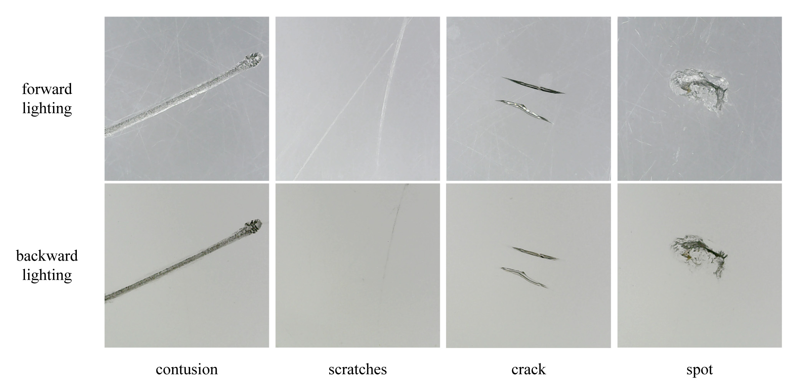

# AGDD
Aircraft glass defect dataset using dual illumination structure.


## The Dataset



This dataset contains defect samples from aircraft glass canopies,
categorized into four types: contusion, scratches, crack, and spot.
Each defect sample includes a pair of images captured under both forward and backward lighting conditions.
The annotations are provided in the Oriented Bounding Box (OBB) format,
and we also include rectangular box annotation files for added flexibility.


## Usage

The raw resource files are stored in the `.data` directory.
We provide the following scripts to generate augmented datasets:

- Run `generate_dual_dataset.py` to generate the dual-modal dataset.
- Run `generate_composite_dataset.py` to use the RGB Channel Fusion method and generate a dataset in YOLO directory format.

The Python generation code requires `numpy`, `opencv-python`, and `scipy` to work correctly.
For specific version requirements, please refer to [requirements.txt](./requirements.txt).


## Citing

If this work is helpful to you, please cite our paper as follows:
```
@article{Li2024dual,
   author = {Li, Zijian and Yao, Yong and Wen, Runyuan and Liu, Qiyang},
   title = {Dual-Modal Illumination System for Defect Detection of Aircraft Glass Canopies},
   journal = {Sensors},
   volume = {24},
   year = {2024},
   issn = {14248220},
   doi = {10.3390/s24206717}
}
```


## License

This work is licensed under a
[Creative Commons Attribution-NonCommercial-ShareAlike 4.0 International License][cc-by-nc-sa].

[![CC BY-NC-SA 4.0][cc-by-nc-sa-image]][cc-by-nc-sa]

[cc-by-nc-sa]: http://creativecommons.org/licenses/by-nc-sa/4.0/
[cc-by-nc-sa-image]: https://licensebuttons.net/l/by-nc-sa/4.0/88x31.png
